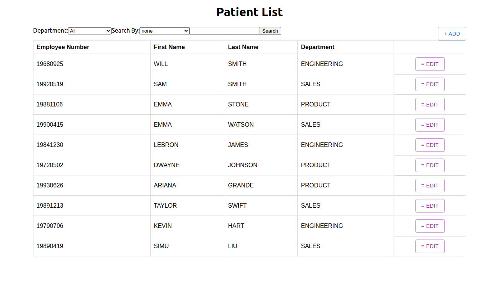

# Employee Directory

  
## Request

An HR Manager at Sample Company currently manages the employee directory using pen and paper. As this company grows, they have come to realise how inefficient and slow the process is for searching and making updates. Therefore, they are requesting a digital solution to help them streamline this process.

### Requirements
You will need to build a RESTful API to support the followingfunctionality:
- Return a list of employees
	- Searchable by first name, last name, or employee number
	- Filterable by department - employees are grouped underdepartments (e.g. sales, product, engineering, etc.)
- Add a new employee
- Update an existing employee’s information
- Remove an employee

  

## Solution

### Tools
- Javascript
- React
- Material UI
- Docker
- Python
- Flask
- SQLAlchemy
- SQLite3
- Nginx
- Gunicorn

### Running Applcation (1st way via docker-compose)[*recommended*]
0. Clone repo `git clone https://github.com/adams-liu/verto-adams.git`
1. Install docker engine and docker-compose
2. Go into the repo where the project exist, you should see client, deployment, server directories, as well as the docker files.
3. Run `docker-compose up` in your terminal to start the server and client containers, this will take a few minutes. `CTRL + C` to stop the containers.
4. You can now visit the application on `localhost:3000`

### Running Applcation (2nd via locally)
0. Clone repo `git clone https://github.com/adams-liu/verto-adams.git`
1. Open up 2 terminals and `cd` into the `server` and `client`
2. For the server, create a virtual environment `python3 -m venv env`
3. Activate it `source env/bin/activate`
4. Install dependencies `pip install -r requirements.txt`
5. Start flask application `flask run`, now the server should be running on `localhost:5000`
6. Open up `verto-adams/client/apis/api.js` and comment out line 1 `let baseUrl = "http://localhost:3000/api/employee"` and uncomment line 2  `let baseUrl = "http://localhost:5000/api/employee"` 
7. In you client terminal install node_modules `yarn install`
8. Run your frontend `npm start` and visit it now on `localhost:3000`

## Improvements
There are a couple of changes I would make to improve this project if given more time.

1. **Department field** - I used a enum field and hardcoded the 3 departments (engineering, product, sales), in the future a better approach would be to create a seperate table for department and have a foreign key relationship from employees to departments. This makes it easier to dynamically update all my fields rather they having to update my fields manually every single time.
2. **Unecessary Packages** -  I know I have installed a lot of node packages, giving more time it may be a good idea to prune unused ones.
3. **Hardcoded Fetch URL** - Currently in the frontend I did a hardcoded fetch url, the better approach is to setup some sort of environment variable, I'm unfamiliar how this works in regards to using docker. And didn't think if the extra effort makes a huge difference. 
4. **Authentication/Authorization** - Will eventually add this, but it takes a bit of time to setup and test.
5. **Unit testing** - This was one area where I don't have much exposure to, but eventually I want to learn this.
6. **UI** - Good styling takes a lot of time 

## Resources
https://blog.miguelgrinberg.com/post/how-to-create-a-react--flask-project
